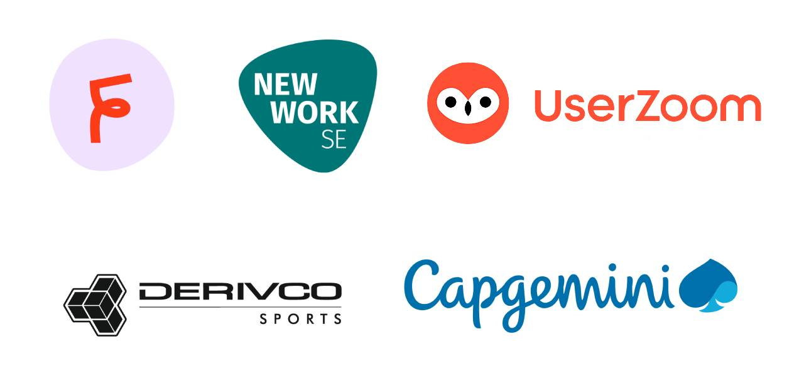

### Hi there, I'm Ale 👋

I help organizations maximize impact, customer value, delivery, speed, and quality.
My main areas of expertise are in Agile team management, best development practices(clean code, TDD, continuous delivery, XP, DevOps), and microservices architectures for scalable products.

Currently, I am highly interested in Machine Learning and AI and how to apply them to new opportunities.

> I love deploying value, even on Fridays™

## Around the web

- 🎙 [How I build teams at femtasy](https://cult.honeypot.io/podcasts/agathes-diary-working-at-femtasy) - Feb, 2021
- ✈️ [How I track planes with Elixir](https://alejandrodev.com/blog/collecting-planes-with-elixir/)
- 📽️ [Some of my presentations](https://alejandrodev.com/slideshows/)

## Organizations

